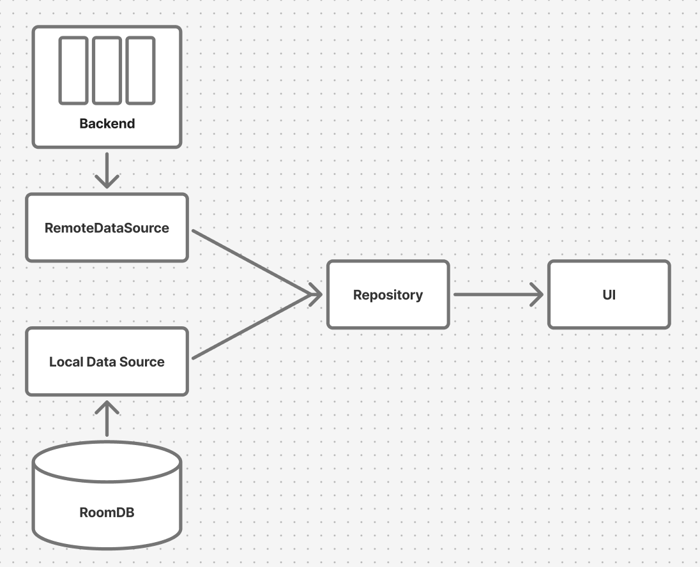

## Project requirements

- Develop a mini Android application that uses the Foursquare API to search for and display details about 
venues, with support for offline mode
- Allow the user to search for venues near their current location using a search term. Display the search results in a list
- When a user selects a venue from the search results, open a screen with details for that venue. Display information such as name, description, opening hours, photos, and contact details.

#### Constraints

Project requirements define displaying of pictures, opening hours and description of venues, but at this moment, these pieces of info are behind the paywall. For illustration purposes, 3 links are hardcoded as example image urls. Opening hours and description are not displayed.

## Running the project
The project is using local properties for storing api key to avoid its public exposal on github.
In local.properties file add line: 
FSQ_API_KEY=your_key

## Structuring the project
In effort to use clean architecture, the app is separated in 3 layers:
- ui
- domain
- data

Domain layer is without dependencies to other modules
Data and UI layer depend on Domain layer
App module handles dependency injection.

#### UI layer architecture 
The project uses unidirectional data flow via MVI pattern. Collection of UI event callbacks and UI state are the only params passed to the composables.

## Approach to data fetching and caching and offline access
Synchronization logic of online and offline data happens in repository using DataOrchestrator class that uses LocalDataSource and RemoteDataSource 
interface implementations to access corresponding data types, coordinate their interactions and to send relevant fetched data towards collectors.

In addition, for passing data, seald class DataSource is defined, which signals the current state of data retrieval process.
Both of Success and Failure subclasses can carry data - this way, in the case of remote fetching failure, we can return cached data in addition to error.

Specific challenge in data retrieval from the local database is filtering results for current surrounding area of the user - in the database, there might be 
a lot of venues with matching names but outside of the current search area, and partial data fetched in previous online searches located in desired area.
Both of these issues are solved by filtering via Haversine algorithm after retrieving veneus with matching names from the database.

## UI
The app takes advantage of simple theming setup in JetpackCompose, endorcing dark theme with bright colors, 
custom font and custom animation made in Compose to convey the Radar-inspired imagery to the user. 

## For future improvement
Error parsing and handling: Instead of passing hardcoded string for general errors, specific parsing 
and classifications of errors can be done to provide the user with more specific error messages and UI

UseCases instead of Repository: this approach could emphasize single responsibility principle in bussiness logic area

Defining standard measures for spacings instead of hardcoding

Caching previous search terms and showing them below search field

Adding tests

Moving screen parts into separate composables for clarity

Adding previews for composables

Giving user the chance to select desired search radius

Adding callbacks to open link and call phone number in venue details
